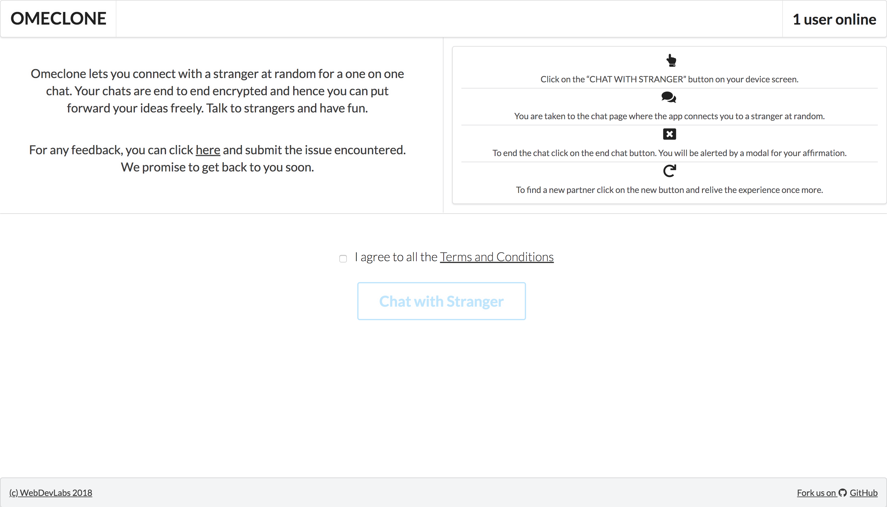
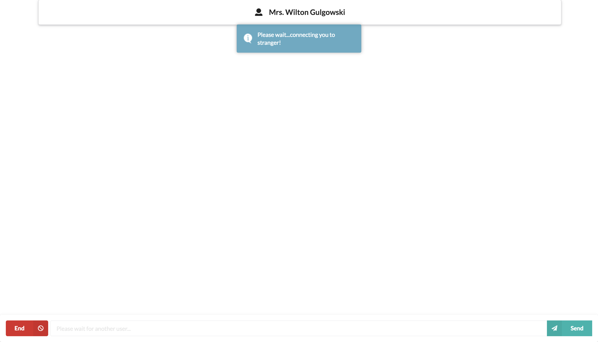
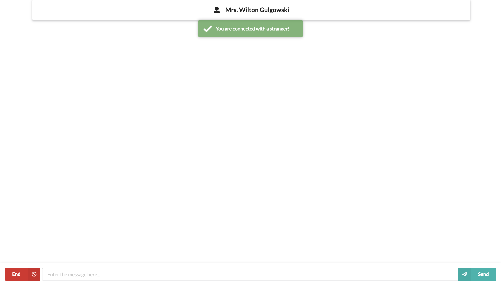

# Omeclone

Omeclone is a platform where you can chat with strangers, make new friends. It's fun to chat with stranger. We took inspiration from omegle.com and tried to build this.

## Screenshots







## Prerequisites

You will need the following things properly installed on your computer.

* **[Git](https://git-scm.com/)** - Git is a version control system which helps in tracking changes in files and also in coordinating with number of people on same project.
* **[Node.js](https://nodejs.org/)** *(node v9.2.1)* *(with NPM v5.5.1)* - Node.js is a JavaScript runtime which is built on the top of chrome's v8 JavaScript engine. You can install Node.js easily with [nvm](https://github.com/creationix/nvm).
* **[Bower](https://bower.io/)** - Bower is a frontend dependency installation package manager. Once you have node and npm installed on your system, you can install bower with just a single command: ```npm install -g bower```.

## Installation

* `git clone <repository-url>` this repository
* `cd Omeclone`
* `npm install` - This will install all the npm packages that are needed.
* `bower install` - This will install all the frontend dependencies.

## Running / Development

* `node index`
* Visit your app at [http://localhost:3000](http://localhost:3000).


## Deployment from master:
>   https://omeclone.herokuapp.com

## Join the development:

* Read [CONTRIBUTING.md](https://github.com/wdlsvnit/Omeclone/blob/master/CONTRIBUTING.md).
* Before you start contributing, run the app in tour local machine, get familiar with it and then check for bugs or more features.
* For any bug or for adding an feature you may open an issue.
* If you would like to work on an issue, drop in a comment at the issue.
* If you have any queries, you can ask on our channel [here](https://t.me/joinchat/DHpmLBJ5imadY_sbMfeW6w).
